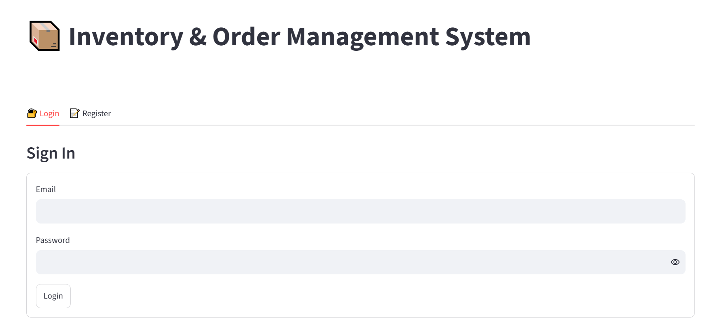
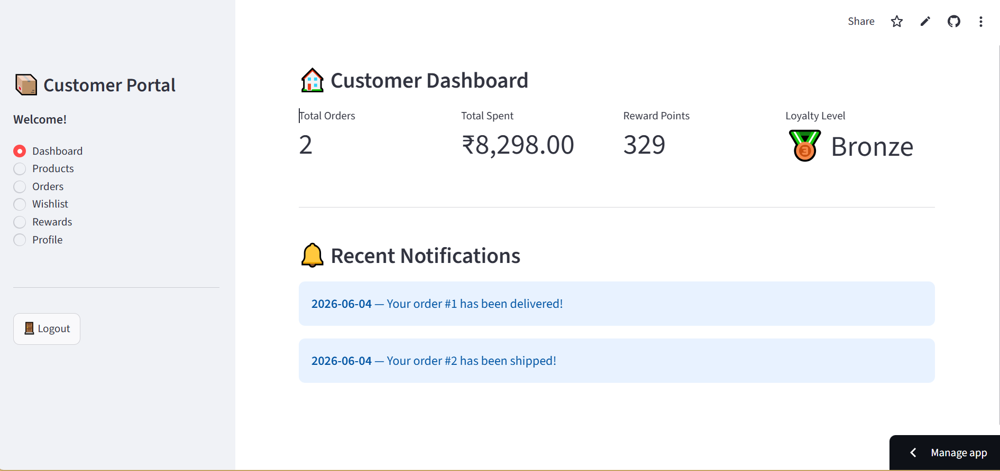
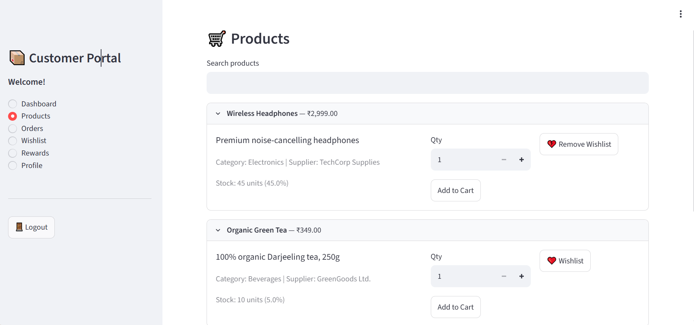
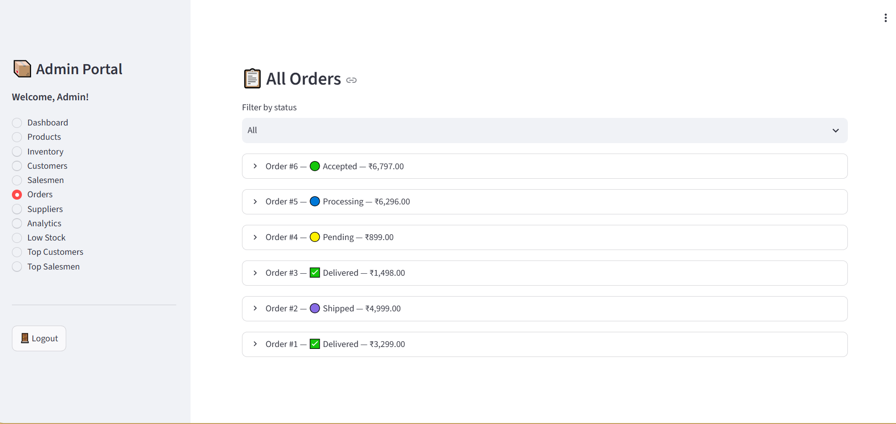
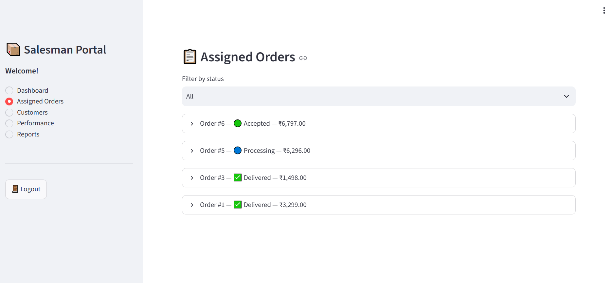
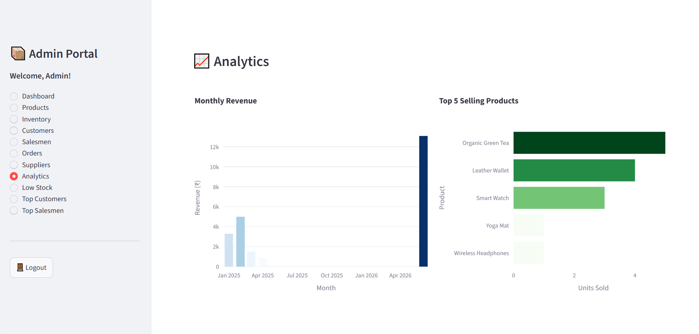
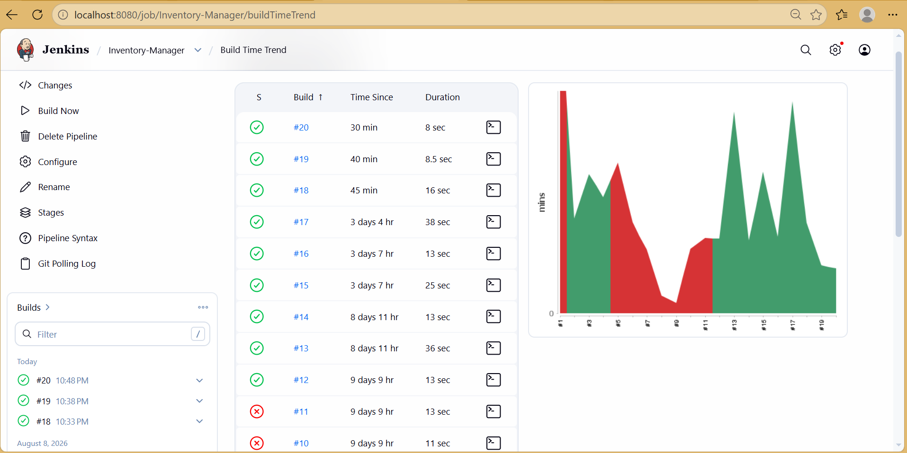
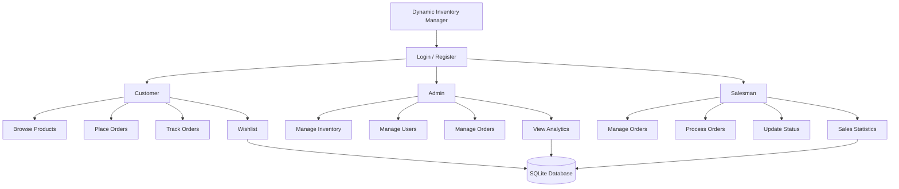
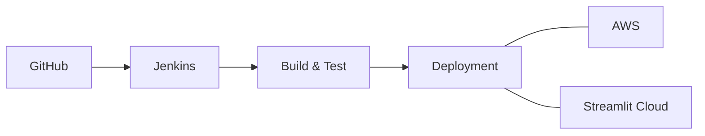

# 📦 Dynamic Inventory Manager

### A Multi-Role Inventory & Order Management System

**Dynamic Inventory Manager** is a web-based inventory and order management application built using **Python, Streamlit, SQLite, and Plotly**.

The system provides dedicated portals for **Customers, Salesmen, and Administrators**, allowing products, inventory, orders, and sales operations to be managed through a single application.

---

## 📸 Project Preview

<table>
  <tr>
    <td align="center">
      
      <br><b>Login</b>
    </td>
    <td align="center">
      
      <br><b>Customer Dashboard</b>
    </td>
  </tr>
  <tr>
    <td align="center">
      
      <br><b>Product Catalog</b>
    </td>
    <td align="center">
      
      <br><b>Order Tracking</b>
    </td>
  </tr>
  <tr>
    <td align="center">
      
      <br><b>Admin Dashboard</b>
    </td>
    <td align="center">
      
      <br><b>Sales Analytics</b>
    </td>
  </tr>
</table>

---

## 🔄 CI/CD Pipeline

<p align="center">
  
</p>

<p align="center">
  <i>Jenkins CI/CD Pipeline</i>
</p>

---

## 🌐 Live Demo

🚀 **[View Live Application](https://dynamic-inventory-manager.streamlit.app/)**

---

##  Tech Stack

| Technology       | Purpose                          |
| ---------------- | -------------------------------- |
|  **Python**    | Application logic and backend    |
|  **Streamlit** | Web application interface        |
|  **SQLite**   | Database management              |
|  **Plotly**    | Interactive charts and analytics |
|  **Git & GitHub**    | Version control |
|  **Jenkins**    | CI/CD automation |
|  **AWS**    | Cloud infrastructure/deployment |
|  **Streamlit Community Cloud**    | Application deployment|
---


## ✨ Key Features

### 👤 Customer Portal

* Register and log in securely
* Browse and search products
* Filter products
* Add products to wishlist
* Place orders
* Track order status
* View order history
* Cancel pending orders
* Manage reward points
* Receive notifications
* Edit profile information

### 🧑‍💼 Salesman Portal

* View assigned orders
* Accept or reject orders
* Process customer orders
* Update order status
* Dispatch and deliver orders
* View sales statistics

### 👨‍💼 Admin Portal

* Manage products and inventory
* Add, update, and delete products
* Monitor stock levels
* Manage users
* View and manage orders
* Monitor sales performance
* View interactive analytics

---

## ⚙️ How It Works

The application uses a **role-based system** where users are directed to the appropriate portal after authentication.



### 🔄 Order Workflow

```text
Customer
   ↓
Select Product
   ↓
Place Order
   ↓
Order Stored in Database
   ↓
Salesman Processes Order
   ↓
Order Status Updated
   ↓
Customer Tracks Order
```

---

## 🔄 CI/CD & Deployment Workflow



---

## 🚀 Getting Started

### Clone the Repository

```bash
git clone https://github.com/Aish257/Dynamic-Inventory-Manager.git
```

### Navigate to the Project

```bash
cd Dynamic-Inventory-Manager
```

### Install Dependencies

```bash
pip install -r requirements.txt
```

### Run the Application

```bash
streamlit run streamlit-app/app.py
```

The application will open in your browser.

---


## 👩‍💻 Author

**Aishwarya C Jagadeesha**

Computer Science Engineering Student

---

⭐ **If you found this project interesting, consider giving the repository a star!**
